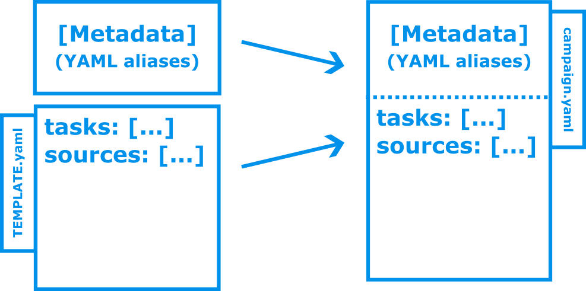

## Running AutoBernese

With AutoBernese installed, you have a new command `ab` available, which lets
you explore the rest of the available functionality based on the help system. By
itself it also does a few house-hold things. These latter side effects are
described below.


### `ab`

Prints out help text to the terminal, describing the core themes of the
application and showing the available sub commands.

```sh title="Command"
ab
```

``` title="Output"
Usage: ab [OPTIONS] COMMAND [ARGS]...

  AutoBernese is a tool that can

  1.  Create Bernese campaigns using the built-in template system.

  2.  Download and organise data for general or campaign-specific use.

  3.  Run the BPE for campaigns with an AutoBernese configuration.

  4.  Do various other things related to GNSS-data processing.

Options:
  --version
  --bsw-release
  --help         Show this message and exit.

Commands:
  campaign (c)   Create campaigns and manage campaign-specific sources and...
  config         Show all or specified configuration section(s).
  dateinfo (dt)  Print date info on date, year+doy or GPS week.
  download       Download all sources in the autobernese configuration file.
  logs           Follow log file (run `tail -f path/to/logfile.log`).
  qc             Quality-control measures
  station        Stand-alone tools for station data.
  troposphere    Stand-alone tools for troposphere data.
```

**Side Effects**

The command itself is a script that imports the AutoBernese Python package.

When run, it creates a *runtime directory* at the same directory level as the
Bernese installation directory `BERN54`, i.e. in the parent directory of the
`$C`.

The directory tree can be seen below:

``` title="AutoBernese runtime directory is in the parent directory of `$C`"
/path/to/environment
├── autobernese     # AutoBernese runtime directory automatically
│                   # created one level up from Bernese-installation directory
│
├── BERN54          # Bernese installation directory,
│                   # a.k.a. `$C` in BERN54/LOADGPS.setvar
└── ...
```

When running `ab` or any sub command, the following happens:

*   The built-in configuration file is read, and any user-configuration file is
    loaded and allowed sections override those in the built-in configuration.
    This combined configuration is the *rendered AutoBernese configuration*. Its
    settings are fixed during the entire runtime of any command that is run.

*   Before any other sub command is run, AutoBernese makes sure that a directory
    `autobernese` is present in the environment directory. If not, the directory
    is created, and the AutoBernese log file `autobernese.log` is created.

*   In addition, the command makes sure that all variables exported in
    `LOADGPS.setvar` exist in the shell environment. If not, a warning is shown,
    and the program exits.

The rendered AutoBernese configuration thus provides a way to access paths and
environment variables set by and derived from the exported variables set in the
LOADGPS.setvar file. These are also available in the user-defined configuration
files and so allows for a seamless integration with the activated Bernese
environment.


### `ab --version`

This command prints the current software version of AutoBernese.

```sh title="Command"
ab --version
```

``` title="Output"
0.3.0
```

### `ab --bsw-release`

This command prints the current software version and release of the activated
Bernese installation in JSON format.

```sh title="Command"
ab --bsw-release
```

``` title="Output"
{
  "version": "5.4",
  "release": "2023-10-16"
}
```


## Show rendered configuration

AutoBernese uses a built-in configuration file to integrate seamlessly into the
given activated Bernese environment. Most of the functionality of AutoBernese
relies on some configuration setting.

The configuration format is a YAML whose syntax features make it highly useful.
These features include re-using content in one place of the YAML document in
some other part of the same document. Read more about the format and relevant
data models on [the configuration-file page][DOCS-CONFIG].

[DOCS-CONFIG]: configuration-files.md

<!-- Sort of like using variables in a computer
program. -->

<!-- This means that repeating some value can be done by referring to the value in
another place. -->

The static document, while being easy to create this way, does
make it harder to read and find potential errors in, when the data structure in
the document becomes larger or more complex in what is re-used, and how.

The following commands lets you have a look at the rendered AutoBernese
configuration file.


### `ab config`

Let us look at the rendered AutoBernese configuration file, where among other
things, we can see the Bernese-installation environment that AutoBernese has
access to.


<!-- The following command prints the content of the section [`bsw_env`]
of the AutoBernese-configuration file containing the environment variables that
the software uses: -->

=== "Configuration file segment"

    ```yaml  linenums="1"
    --8<-- "src/ab/configuration/env.yaml::31"
    # (...)
    ```

=== "Rendered configuration"

    ```sh title="Command"
    ab config
    ```

    ```python title="Output"
    {
        'bsw_env': {
            'C': '/home/bsw/prod/BERN54',
            'DOC': '/home/bsw/prod/BERN54/SUPGUI/DOC',
            'PAN': '/home/bsw/prod/BERN54/SUPGUI/PAN',
            'MODEL': '/home/bsw/prod/BERN54/GLOBAL/MODEL',
            'CONFIG': '/home/bsw/prod/BERN54/GLOBAL/CONFIG',
            'D': '/mnt/refgps/bsw/dev/DATAPOOL',
            'P': '/home/bsw/prod/data/CAMPAIGN54',
            'S': '/mnt/refgps/bsw/dev/SAVEDISK',
            'U': '/home/e088195/bsw/dev/user',
            'T': '/home/e088195/bsw/dev/temp'
        },
        # (...)
    }
    ```

!!! attention

    As seen above, you see that not all the variables set in BSW's `LOADGPS.setvar`
    script are included, but this is all that AutoBernese is using for now.


### `ab config <section>`

Adding the name of one of the outer-most keys in the YAML configuration, only
the content of `<section>` will be shown.

Available sections are

```yaml title="Available sections in the rendered configuration"
# Bernese GNSS Software [BSW] environment variables available after 'source'ing
# the shell script `LOADGPS.setvar` in the root of the installation directory.
bsw_env:
  # (...)

# Specific files in the Bernese environment that we need to access
bsw_files:
  # (...)

# We define the environment root directory as the one containing the BSW
# installation. It is assumed to be a directory that each user can can write to.
env: &env !Parent [*C]

# AutoBernese runtime environment
runtime:
  # (...)

## Default sections that can be overriden by the user

station:
  # (...)

campaign:
  # (...)

sources: []
```


**Example**

The following command prints the content of the section [`runtime`] of the
AutoBernese-configuration file containing the internal settings for the
AutoBernese runtime directory:

```yaml title="Configuration file segment" linenums="41"
# (...)

--8<-- "src/ab/configuration/env.yaml:76:102"

# (...)
```

```sh title="Command to see the rendered runtime configuration"
ab config runtime
```

```python title="Rendered configuration"
{
    'ab': PosixPath('/home/bsw/prod/autobernese'),
    'logging': {
        'filename': PosixPath('/home/bsw/prod/autobernese/autobernese.log'),
        'format': '%(asctime)s | {user} | %(levelname)s | %(name)s | %(message)s',
        'datefmt': '%Y-%m-%d %H:%M:%S',
        'style': '%',
        'level': 'DEBUG'
    },
    'campaign_templates': PosixPath('/home/bsw/prod/autobernese/templates'),
    'user_config': PosixPath('/home/bsw/prod/autobernese/autobernese.yaml'),
    'user_sections': ['station', 'campaign', 'sources']
}
```


## Download sources

Data acquisition from and management of external sources is a large part of the
work performed, before creating Bernese campaigns.

AutoBernese lets users download external sources from HTTP anf FTP and store
them in any available local filepath desired.

AutoBernese can download sources common to all users as well as
campaign-specific sources.

To do either, the sources must be specified in the relevant configuration file:

| Download      | File                                 |
| ------------- | ------------------------------------ |
| Common data   | `$C/../autobernese/autobernese.yaml` |
| Campaign data | `$P/<campaign-name>/campaign.yaml`   |


[A separate document](download-sources.md) describes in detail how to set up
sources in the configuration files.


### `ab download`

This downloads data from the sources specified in the rendered AutoBernese
configuration. Below is the command for downloading sources for a given
campaign.

The built-in configuration contains no sources, so running the command without a
user-supplied configuration file in the AutoBernese runtime directory, you will
see the following.

**Example 1**

=== "Configuration file segment"

    ```yaml  linenums="103"
    # (...)

    --8<-- "src/ab/configuration/env.yaml:103:"
    ```

=== "Rendered configuration"

    ```sh title="Command"
    ab config sources
    ```

    ```python title="Output"
    []
    ```

=== "Command output"

    ```sh title="Command"
    ab download
    ```

    ``` title="Output"
    Finished downloading sources ...
    Overall status:
    Downloaded: 0
    Existing: 0
    ```

**Example 2**

This example illustrates the case, where a manually adding the AutoBernese
configuration file `autobernese.yaml` with some entries in the `source` section
is added to the [AutoBernese runtime directory](../concepts.md).

=== "Configuration file segment"

    ```yaml linenums="1"
    sources:

    - !Source
      identifier: EUREF_STA
      description: EUREF STA file
      url: ftp://epncb.oma.be/pub/station/general/EUREF.STA
      destination: !Path [*D, station]

    - !Source
      identifier: BSW_MODEL
      description: BSW Model data
      url: ftp://ftp.aiub.unibe.ch/BSWUSER54/MODEL/
      destination: *MODEL
      filenames: ['*']
      max_age: 1

    - !Source
      identifier: BSW_CONFIG
      description: BSW Configuration data
      url: ftp://ftp.aiub.unibe.ch/BSWUSER54/CONFIG/
      destination: *CONFIG
      filenames: ['*']
      max_age: 1
    ```

=== "Rendered configuration"

    ```sh title="Command"
    ab config sources
    ```

    ```python title="Output"
    [
        Source(
            identifier='EUREF_STA',
            description='EUREF STA file',
            url='ftp://epncb.oma.be/pub/station/general/EUREF.STA',
            destination=PosixPath('/home/bsw/prod/data/DATAPOOL/station'),
            filenames=None,
            parameters=None,
            max_age=inf
        ),
        Source(
            identifier='BSW_MODEL',
            description='BSW Model data',
            url='ftp://ftp.aiub.unibe.ch/BSWUSER54/MODEL/',
            destination=PosixPath('/home/bsw/prod/BERN54/GLOBAL/MODEL'),
            filenames=['*'],
            parameters=None,
            max_age=1
        ),
        Source(
            identifier='BSW_CONFIG',
            description='BSW Configuration data',
            url='ftp://ftp.aiub.unibe.ch/BSWUSER54/CONFIG/',
            destination=PosixPath('/home/bsw/prod/BERN54/GLOBAL/CONFIG'),
            filenames=['*'],
            parameters=None,
            max_age=1
        )
    ]
    ```

=== "Command output"

    ```sh title="Command"
    ab download
    ```

    ``` title="Output"
    Source: EUREF STA file
     Downloaded: 1
     Existing: 0
    Source: BSW Model data
     Downloaded: 7
     Existing: 0
    Source: BSW Configuration data
     Downloaded: 43
     Existing: 0
    Finished downloading sources ...
    Overall status:
     Downloaded: 51
     Existing: 0
    ```


### `ab download -c <campaign-name>`

This downloads data from the sources specified in the campaign-specific
configuration file `campaign.yaml` in the root of the campaign directory of
campaign `<campaign-name>`.

The download procedure is exactly the same as for the common sources above. Each
source in the section `sources` has its remote paths resolved and downloaded to
the specified download dirctory.


The difference between specifying the sources in the common configuration file
and a campaign-specific is that the sources in the campaign-configuration file
has access to campaign metadata. suh as beginning and end dates for the Bernese
campaign. This is explained in more detail in the section [Download sources][DOCS-DL-SRC].

[DOCS-DL-SRC]: download-sources.md

**Example**

=== "Configuration file segment"

    ```yaml  linenums="28"
    # (...)
    sources:

    - !Source
    identifier: RINEX_EPN
    description: RINEX data
    url: ftp://ftp.epncb.oma.be/pub/obs/{date.year}/{date.doy:03d}
    destination: !Path [*D, RINEX, '{date.gps_week}']
    filenames:
    - '{station}_{date.year}{date.doy:03d}0000_01D_30S_MO.crx.gz'
    parameters:
        station:
        - BUDP00DNK_R
        - ONSA00SWE_R
        - OSLS00NOR_S
        - POTS00DEU_R
        - WSRT00NLD_R
        - WTZR00DEU_R
        date: !DateRange
          beg: 2023-01-01
          end: 2023-01-02
    ```

    !!! note "Python format strings"

        The strings using the Python format-string syntax are explicitly written
        as strings with quotes, since they contain Python syntax for template
        strings that clash with YAML syntx for dictionaries.

=== "Rendered configuration"

    ```sh title="Command"
    ab config -c <campaign-name> sources
    ```

    ```python title="Output"
    [
        Source(
            identifier='RINEX_EPN',
            description='RINEX data',
            url='ftp://ftp.epncb.oma.be/pub/obs/{date.year}/{date.doy:03d}',
            destination=PosixPath('/home/bsw/prod/data/DATAPOOL/RINEX/{date.gps_week}'),
            filenames=['{station}_{date.year}{date.doy:03d}0000_01D_30S_MO.crx.gz'],
            parameters={
                'station': [
                    'BUDP00DNK_R',
                    'ONSA00SWE_R',
                    'OSLS00NOR_S',
                    'POTS00DEU_R',
                    'RIGA00LVA_R',
                    'WSRT00NLD_R',
                    'WTZR00DEU_R'
                ],
                'date': [GPSDate(2023, 1, 1), GPSDate(2023, 1, 2)]
            },
            max_age=inf
        )
    ]
    ```

=== "Command output"

    ```sh title="Command"
    ab download -c <campaign-name>
    ```

    ``` title="Output"
    Source: RINEX data
      Downloaded: 12
      Existing: 0
    Finished downloading sources ...
    Overall status:
      Downloaded: 12
      Existing: 0
    ```


## Campaign management

```sh title="Command"
ab campaign
```

``` title="Output"
Usage: ab campaign [OPTIONS] COMMAND [ARGS]...

  Create campaigns and manage campaign-specific sources and run BPE tasks.

Options:
  --help  Show this message and exit.

Commands:
  create     Create a Bernese campaign with directory content based on...
  ls         List existing campaigns
  run        Resolve campaign tasks and run them all.
  sources    Print the campaign-specific sources.
  tasks      Show tasks for a campaign.
  templates  List available campaign templates or show content of given...
```


### List existing Bernese campaigns

```sh title="Command"
ab campaign ls
```

``` title="Output"
Existing campaigns registered in the BSW campaign list:
/home/bsw/prod/data/CAMPAIGN54/EXAMPLE
```

### List AutoBernese details of each Bernese campaign

List campaign templates and template content.

```sh title="Command"
ab campaign ls -v
```

``` title="Output"
Existing campaigns registered in the BSW campaign list:
/home/bsw/prod/data/CAMPAIGN54/EXAMPLE example 0.1.0 USERNAME 2023-06-08
```


### List available campaign-configuration templates

```sh title="Command"
ab campaign templates
```

``` title="Output"
default
```


### Show content of the campaign-configuration template

```sh title="Command"
ab campaign templates default
```

```yaml title="Output"
tasks: []
sources: []
```


## Create a campaign

```sh title="Command"
ab campaign create WK2222 -b 2022-08-07 -e 2022-08-13
ab campaign create WK2222 -t <template-name> -b 2022-08-07 -e 2022-08-13
```

``` title="Output"
```

<div class="result" markdown>
  
</div>


## Show the sources specified for a given campaign

```sh title="Command"
ab campaign sources <campaign-name>
```

``` title="Output"
```


## Show the runnable tasks for a given campaign

```sh title="Command"
ab campaign tasks <campaign-name>
```

``` title="Output"
```


## Run tasks for a given campaign

```sh title="Command"
ab campaign run <campaign-name>
```

``` title="Output"
```

## Delete sub directory content in given campaign

Adding [a `clean` section][CONF_CAMPAIGN_CLEAN] to the campaign configuration allows for easy
cleaning of entire subdirectories in the campaign directory.

[CONF_CAMPAIGN_CLEAN]: configuration-files.md#the-clean-section-not-shown

```sh title="Command"
ab c clean EXAMPLE
```

```sh title="Output"
/home/bsw/prod/data/CAMPAIGN54/EXAMPLE/OUT
/home/bsw/prod/data/CAMPAIGN54/EXAMPLE/SOL
Proceed (y/[n]): y
# List of deleted files
```


## Station-related utilities

The station command sub group has two commands:

```sh title="Command"
ab station
```

``` title="Output"
Usage: ab station [OPTIONS] COMMAND [ARGS]...

  Stand-alone tools for station data.

Options:
  --help  Show this message and exit.

Commands:
  parse-sitelog  Parse sitelog and print it to the screen.
  sitelogs2sta   Create a STA file from sitelogs and other station info.
```

### Show what is parsed from a sitelog when creating a STA file.

This command shows what is extracted from a site-log file, when creating a
STA-file with the other command.

```sh title="Command"
ab station parse-sitelog $D/sitelogs/budp00dnk_20221113.log
```

```json title="Output"
{
  "sec1": {
    "site_name": "Kobenhavn",
    "four_character_id": "BUDP",
    "domes": "10101M003",
    "date_installed": "1999 10 28"
  },
  "sec2": {
    "city_or_town": "Kobenhavn",
    "country": "Denmark"
  },
  "sec3": [
    {
      "receiver_type": "ASHTECH Z-XII3",
      "receiver_serial_number": "02259",
      "firmware": "1D04/1L00",
      "date_installed": "1999 01 06",
      "date_removed": "2001 12 18"
    },
    // ...
  ],
  "sec4": [
    // ...
  ]
}
```


### Create STA file from sitelogs

As part of our internal pre-processing, we create a single STA-file from
relevant site-log files.

This can be done in four different ways depending on the input the command
receives.


#### No arguments

Running the command with no arguments:

```sh title="Command"
ab station sitelogs2sta
```

creates a STA file with the settings obtained from the `station` section of the
rendered AutoBernese configuration file.

The default settings in the built-in configuration file are:


```yaml title="`station` section of the built-in configuration file"
--8<-- "src/ab/configuration/env.yaml:107:117"
```

In this case, the sitelogs to use will be all the `.log` files in `$D/sitelogs`,
with no individually-calibrated instrumentation, and the output file
`sitelogs.STA` is placed in the directory `$D/station`.


#### Using campaign-specific settings

You may add the same section in your campaign-specific configuration file and provide the name of the campaign to the command in order to use this as your input.

```yaml title="`campaign.yaml`"
station:
  sitelogs:
  - !Path [*D, sitelogs, 'sta1*.log'
  - !Path [*D, sitelogs, 'sta2*.log'
  - !Path [*D, sitelogs, 'sta3*.log'
  individually_calibrated: [sta1]
  output_sta_file: !Path [*P, *campaign*, STA, campaign.STA]
```

This has the implications that you may use the YAML aliases available in the
campaign configuration as well as thos in the common configuration.

As seen in the example configuration above, you may then create the STA file
directly inside your campaing's STA directory. If your campaign has the name
`CAMPAIGN`, the command you type will then be:

```sh title="Command"
ab station sitelogs2sta -c CAMPAIGN
```


#### Create stations.STA from custom configuration file

Thirdly, as this example demonstrates, you can build a STA file with a custom input YAML file located anywhere available on the filesystem. The following example also shows that the output file can be saved to your current working directory if not specific path is specified:

```yaml title="station.yaml"
sitelogs:
- BLAH00DNK_20230101.log
- BLUH00DNK_20220101.log
individually_calibrated: [BLUH]
output_sta_file: sitelogs.STA
```

```sh title="Command"
ab station sitelogs2sta -f station.yaml
```


#### Create stations.STA from command-line arguments

finally, it is also possible to give all the settings to the command as
command-line arguments:

```sh title="Command"
ab station sitelogs2sta -i BLAH00DNK_20230101.log -i BLUH00DNK_20220101.log -k BLUH -o sitelogs.STA
```

The above, gives the same result as with the arguments given in the special
`station.yaml` file.


## Combine troposphere hour files to day files

```sh title="Command"
ab troposphere
```

``` title="Output"
Usage: ab troposphere [OPTIONS] COMMAND [ARGS]...

  Stand-alone tools for troposphere-delay model data (VMF3).

Options:
  --help  Show this message and exit.

Commands:
  build   Concatenate hour files (`H%H`) into dayfiles.
  status  Print availability of hour and day files in selected interval.
```

The two sub commands `status` and `build` provide a status on the availability
of input files (six-hour interval model data) and the existence of the output
file storing the concatenated content of a complete day from midnight to
midnight (both midnights included).

The tool needs locations for the downloaded data and the output files as well as
the interval dates so it can examine (`status`) the input and output or produce
(`build`) the output files.

The `status` and `build` commands have the same call signature with the following logic:

*   Specify input path, output path and start and end dates to see status or build output.

*   If either of (or both) the input path `ipath` or the output path `opath` are
    not given, look for them in the common user configuration
    (`autobernese.yaml`), where they should be defined in the following way
    (using our path scheme, yours may differ):

    ```yaml title="`autobernese.yaml`"
    # (...)
    troposphere:
      ipath: /path/to/your/DATAPOOL/VMF3/1x1_OP_H/{date.year}
      opath: /path/to/your/DATAPOOL/VMF3/1x1_OP_GRD/{date.year}
    # (...)
    ```

    Or even so, using the AutoBernese YAML aliases:


    ```yaml title="`autobernese.yaml`"
    # (...)
    troposphere:
      ipath: !Path [*D, VMF3, '1x1_OP_H', '{date.year}']
      opath: !Path [*D, VMF3, '1x1_OP_GRD', '{date.year}']
    # (...)
    ```


### Build day files

Build day files from previously-downloaded hour files for the given interval.

```sh title="Command"
ab troposphere build -i $D/VMF3/1x1_OP_H/2022 -o $D/VMF3/1x1_OP_GRD/2022 -b 2023-01-01 -e 2023-01-02
```

``` title="Output"
Build VMF3 files for chosen interval 2023-01-01 to 2023-01-02 ...
Building /home/bsw/prod/data/DATAPOOL/VMF3/1x1_OP_GRD/2023/VMFG_20230010.GRD ... SUCCESS
Building /home/bsw/prod/data/DATAPOOL/VMF3/1x1_OP_GRD/2023/VMFG_20230020.GRD ... FAILED
  Error: Missing input files for VMF3DayFile(date=GPSDate(2023, 1, 2), ...) ...
```

Under the hood, the actual full file paths to the input and output files are reated in the same way as you would define them in a AutoBernese `Source` configuration in your common or campaign-specific configuration file. The filepaths are thus created from a template path, where each filename is generated from an input date. Now, the name of the date instances is `date`.

With this information, a user is able to use this in the input path given as the command-line input in the following way:

```sh title="Command"
ab troposphere build -i "${D}/VMF3/1x1_OP_H/{date.year}" -o "${D}/VMF3/1x1_OP_GRD/{date.year}" -b 2023-01-01 -e 2023-01-02
```

``` title="Output"
Build VMF3 files for chosen interval 2023-01-01 to 2023-01-02 ...
Building /home/bsw/prod/data/DATAPOOL/VMF3/1x1_OP_GRD/2023/VMFG_20230010.GRD ... SUCCESS
Building /home/bsw/prod/data/DATAPOOL/VMF3/1x1_OP_GRD/2023/VMFG_20230020.GRD ... FAILED
  Error: Missing input files for VMF3DayFile(date=GPSDate(2023, 1, 2), ...) ...
```

Typing in the paths in this command is cumbersome, so it is more efficient to
encode your path convention into the common user configuration file under its
own section `troposphere`, like shown above.

The same command would then look like this:

```sh title="Command"
ab troposphere build -b 2023-01-01 -e 2023-01-02
```

``` title="Output"
Build VMF3 files for chosen interval 2023-01-01 to 2023-01-02 ...
Building /home/bsw/prod/data/DATAPOOL/VMF3/1x1_OP_GRD/2023/VMFG_20230010.GRD ... SUCCESS
Building /home/bsw/prod/data/DATAPOOL/VMF3/1x1_OP_GRD/2023/VMFG_20230020.GRD ... FAILED
  Error: Missing input files for VMF3DayFile(date=GPSDate(2023, 1, 2), ...) ...
```


### Status

Show the status of day files and input they are based on for the given interval.

See also the description under **Build day files** for possible ways to run the
command with or without configuration setup.

```sh title="Command"
ab troposphere status -b 2023-01-01 -e 2023-01-02
```

```json title="Output"
[
  {
    'date': '2023-01-01',
    'input_available': True,
    'output_file_exists': True,
    'output_file': '/home/bsw/prod/data/DATAPOOL/VMF3/1x1_OP_GRD/2023/VMFG_20230010.GRD'
  },
  {
    'date': '2023-01-02',
    'input_available': False,
    'output_file_exists': False,
    'output_file': '/home/bsw/prod/data/DATAPOOL/VMF3/1x1_OP_GRD/2023/VMFG_20230020.GRD'
  }
]
```


## Show date information for a specific date or GPS week

Get general date information based on input date as GPS week, date, year+day-of-year.

```sh title="Command"
ab dateinfo
```

``` title="Output"
Usage: ab dateinfo [OPTIONS] COMMAND [ARGS]...

  Print date info on date, year+doy or GPS week.

Options:
  --help  Show this message and exit.

Commands:
  gpsweek  Show date information based on GPS week.
  ydoy     Show date information based on Year and day of year [DOY].
  ymd      Show date information based on date.
```

=== "`ymd`"

    ```sh title="Command"
    ab dateinfo ymd 2022-08-07
    ```

    ```json title="Output"
    {
      "weekday": "Sunday",
      "timestamp": "2022-08-07",
      "doy": 219,
      "iso_week": 31,
      "iso_weekday": 7,
      "gps_week": 2222,
      "gps_weekday": 0,
      "gps_week_beg": "2022-08-07",
      "gps_week_end": "2022-08-13"
    }
    ```

=== "`ydoy`"

    ```sh title="Command"
    ab dateinfo ydoy 2022 219
    ```

    ```json title="Output"
    {
      "weekday": "Sunday",
      "timestamp": "2022-08-07",
      "doy": 219,
      "iso_week": 31,
      "iso_weekday": 7,
      "gps_week": 2222,
      "gps_weekday": 0,
      "gps_week_beg": "2022-08-07",
      "gps_week_end": "2022-08-13"
    }
    ```

=== "`gpsweek`"

    ```sh title="Command"
    ab dateinfo gpsweek 2222
    ```

    ```json title="Output"
    {
      "weekday": "Sunday",
      "timestamp": "2022-08-07",
      "doy": 219,
      "iso_week": 31,
      "iso_weekday": 7,
      "gps_week": 2222,
      "gps_weekday": 0,
      "gps_week_beg": "2022-08-07",
      "gps_week_end": "2022-08-13"
    }
    ```

## Examine the Logfile to get more verbose output

```sh title="Command"
ab logs
```

``` title="Output"
2023-06-28 11:38:12 | USERNAME | DEBUG | ab.data.ftp | OSLS00NOR_S_20230010000_01D_30S_MO.crx.gz already downloaded ...
2023-06-28 11:38:12 | USERNAME | DEBUG | ab.data.ftp | OSLS00NOR_S_20230020000_01D_30S_MO.crx.gz already downloaded ...
2023-06-28 11:38:12 | USERNAME | DEBUG | ab.data.ftp | POTS00DEU_R_20230010000_01D_30S_MO.crx.gz already downloaded ...
2023-06-28 11:38:12 | USERNAME | DEBUG | ab.data.ftp | POTS00DEU_R_20230020000_01D_30S_MO.crx.gz already downloaded ...
2023-06-28 11:38:12 | USERNAME | DEBUG | ab.data.ftp | WSRT00NLD_R_20230010000_01D_30S_MO.crx.gz already downloaded ...
2023-06-28 11:38:12 | USERNAME | DEBUG | ab.data.ftp | WSRT00NLD_R_20230020000_01D_30S_MO.crx.gz already downloaded ...
2023-06-28 11:38:12 | USERNAME | DEBUG | ab.data.ftp | WTZR00DEU_R_20230010000_01D_30S_MO.crx.gz already downloaded ...
2023-06-28 11:38:12 | USERNAME | DEBUG | ab.data.ftp | WTZR00DEU_R_20230020000_01D_30S_MO.crx.gz already downloaded ...
2023-06-28 11:38:12 | USERNAME | DEBUG | ab.cli | Finished downloading sources ...
2023-06-28 13:28:51 | USERNAME | DEBUG | ab.cli | Show log tail ...
```

To exit, press <kbd>Ctrl</kbd> + <kbd>C</kbd>.
